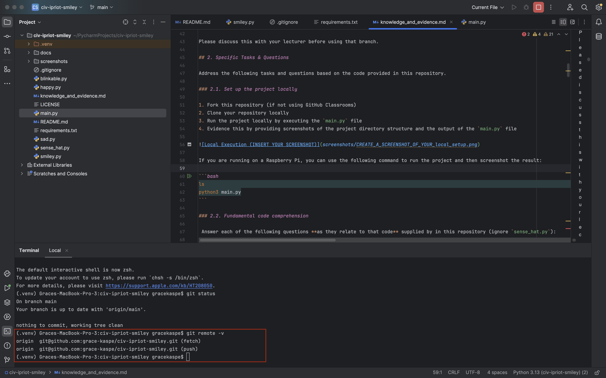
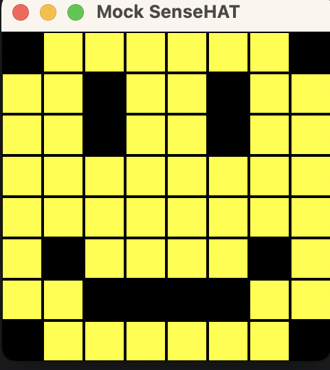
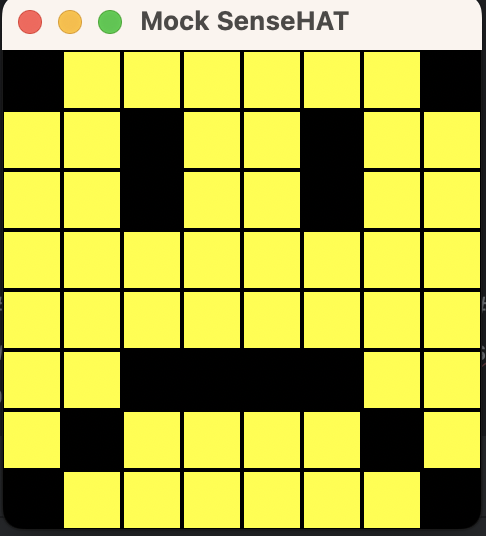
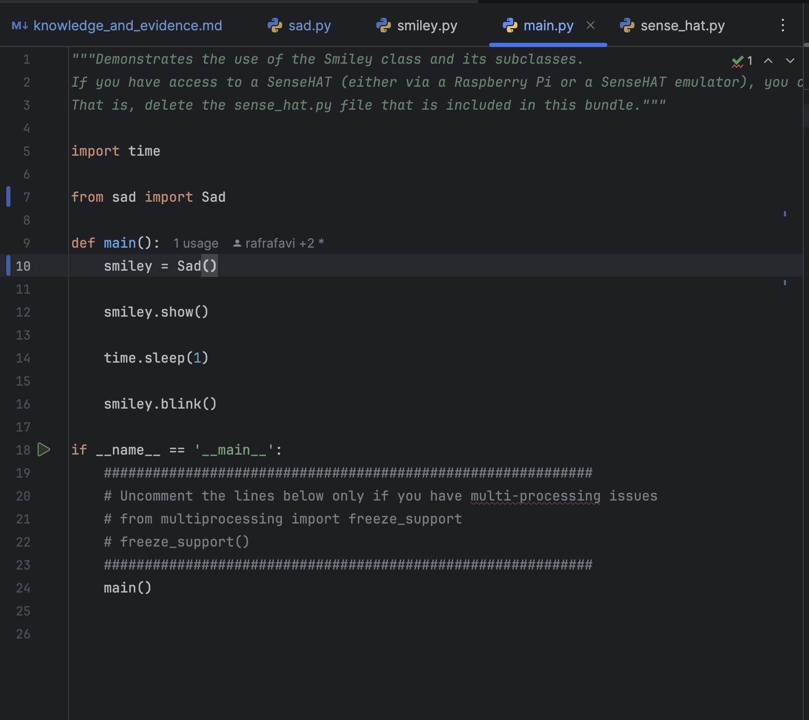
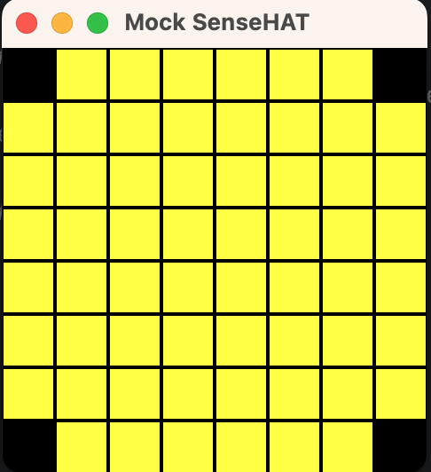
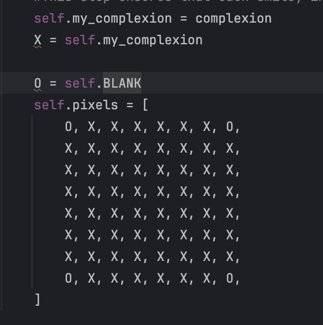
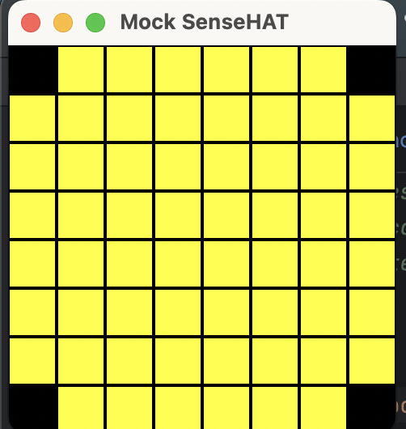
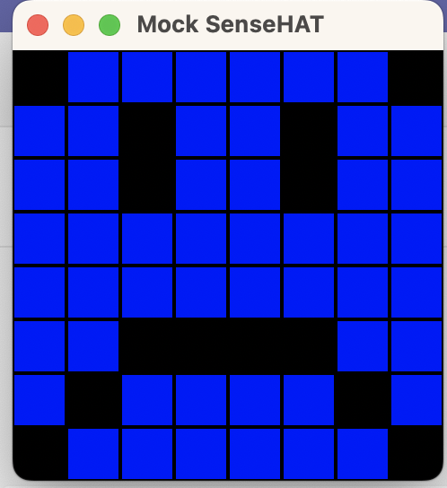
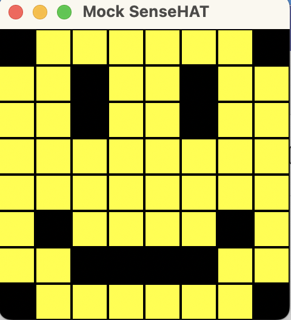
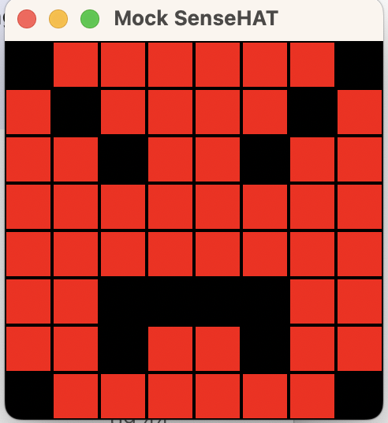

# Evidence and Knowledge

This document includes instructions and knowledge questions that must be completed to receive a *Competent* grade on this portfolio task.

## 1. Required evidence

### 1.1. Answer all questions in this document

- Each answer should be complete, well-articulated, and within the specified word count limits (if added) for each question.
- Please make sure **all** external sources are properly cited.
- You must **use your own words**. Please include your full chat transcripts if you use generative AI in any way.
- Generative AI hallucinates, is not an authoritative source

### 1.2. Make all the required modifications to the code

- Please follow the instructions in this document to make the changes needed to the code.

- When requested to upload evidence, upload all screenshots to `screenshots/` and embed them in this document. For example:

```markdown

```


> Note the `!`, and the use of a relative path.

- You must upload the code into your GitHub repository.
- While you can use a branch, your code should be in main when you submit.
- Upload a zip of this repository to Blackboard when you are ready to submit.
- You will be notified of your result via Blackboard
- However, if using GitHub classrooms, you may also receive additional feedback on GitHub directly

### 1.3. Optional: Use of Raspberry Pi and SenseHat

Raspberry Pi or SenseHat is **optional** for this activity. You can use the included `sense_hat.py` file to simulate the SenseHat on your computer.

If you use a Pi, please **delete** the `sense_hat.py` file.

### 1.4. Accessible version of the code

This project relies on visual patterns that appear on an LED matrix. If you have any accessibility requirements, you can use the `udl/accessible` branch to complete the project. This branch provides an accessible code version that uses text-based patterns instead of visual ones.

Please discuss this with your lecturer before using that branch.

## 2. Specific Tasks & Questions

Address the following tasks and questions based on the code provided in this repository.

### 2.1. Set up the project locally

1. Fork this repository (if not using GitHub Classrooms)
2. Clone your repository locally
3. Run the project locally by executing the `main.py` file
4. Evidence this by providing screenshots of the project directory structure and the output of the `main.py` file




If you are running on a Raspberry Pi, you can use the following command to run the project and then screenshot the result:

```bash
ls
python3 main.py
```

### 2.2. Fundamental code comprehension

 Answer each of the following questions **as they relate to that code** supplied by in this repository (ignore `sense_hat.py`):

1. Examine the code for the `smiley.py` file and provide  an example of a variable of each of the following types and their corresponding values (`_` should be replaced with the appropriate values):

   | Type                    | name    | value           |
   | ----------              |---------|-----------------|
   | built-in primitive type | dimmed  | True            |
   | built-in composite type | WHITE   | (255, 255, 255) |
   | user-defined type       | Smiley  | -               |

2. Fill in (`_`) the following table based on the code in `smiley.py`:

   | Object                   | Type                                                                        |
   | ------------             |-----------------------------------------------------------------------------|
   | self.pixels              | list                                                                        |
   | A member of self.pixels  | tuple                                                                       |
   | self                     | the instance of the Smiley class, as seen here, `<class '__main__.Smiley'>` |

3. Examine the code for `smiley.py`, `sad.py`, and `happy.py`. Give an example of each of the following control structures using an example from **each** of these files. Include the first line and the line range:

   | Control Flow | File     | First line          | Line range |
   | ------------ |----------|---------------------|-----------|
   |  sequence    | smile.py | self.pixels = [     | 17-26     |
   |  selection   | sad.py   | if wide_open:       | 26-29     |
   |  iteration   | happy.py | for pixel in mouth: | 21-22     |

4. Though everything in Python is an object, it is sometimes said to have four "primitive" types. Examining the three files `smiley.py`, `sad.py`, and `happy.py`, identify which of the following types are used in any of these files, and give an example of each (use an example from the code, if applicable, otherwise provide an example of your own):

   | Type                    | Used? | Example                                                    |
   | ----------------------- |-------|------------------------------------------------------------|
   | int                     | y     | WHITE[0] , which is a tuple of ints. The value will be 255 |
   | float                   | y     | delay=0.25                                                 |
   | str                     | n     | name = "Grace"                                             |
   | bool                    | y     | dimmed=True                                                |

5. Examining `smiley.py`, provide an example of a class variable and an instance variable (attribute). Explain **why** one is defined as a class variable and the other as an instance variable.

> WHITE is an example of a  class variable. self.sense_hat is an example of an instance variable. Class variable is shared with all instances within "Smiley". White is used commonly throughout the different instances and therefore it is defined as class variable.
> Instance variable, on the other hand in only defined to that specific instance, and is unique to it. Example of instance variable is  self.sense_hat. 

6. Examine `happy.py`, and identify the constructor (initializer) for the `Happy` class:
   1. What is the purpose of a constructor (in general) and this one (in particular)?

   > In general, it is used to initialize the attributes of the new object.
   > In happy.py file, the new object is Happy. The constructor here is used to initalise the parent class's attributes, which is to set the pixel layout.

   2. What statement(s) does it execute (consider the `super` call), and what is the result?

   > It executes every statement from Smiley class, and it also runs new statements too, such as draw_mouth and draw_eyes.
   > Super is used to combine the functionality of the base class with the derived.
   > The result is a Smiley with a happy expression, with a happy eyes and happy mouth.

### 2.3. Code style

1. What code style is used in the code? Is it likely to be the same as the code style used in the SenseHat? Give to reasons as to why/why not:

> PEP8 is the code style being used.
> Yes, it is likely to be the same because SenseHat is imported into smiley.py in line 1 in CamelCase. In Pep8 class uses CamelCase, method/variables uses snake_case 

2. List three aspects of this convention you see applied in the code.

> 1. The use of 4 spaces per indentation level. This is seen inside the function, class, if statement, loop statement.
> 2. The use of `CamelCase` for Classes; `snake_case` for variables; ALL_CAPS for constants
> 3. Imports are put at the top of the file and have separate line each.

3. Give two examples of organizational documentation in the code.

> 1. In smile.py line 12, we can see the use of basic commenting, starting with the `#` key... `# We have encapsulated the SenseHat object`
> 2. In smile.py line 9-31, under the dim_display function, we can see the use of docstring `"""
        Set the SenseHat's light intensity to low (True) or high (False)
        :param dimmed: Dim the display if True, otherwise don't dim
        """`

### 2.4. Identifying and understanding classes

> Note: Ignore the `sense_hat.py` file when answering the questions below

1. List all the classes you identified in the project. Indicate which classes are base classes and which are subclasses. For subclasses, identify all direct base classes.
  
  Use the following table for your answers:

| Class Name | Super or Sub? | Direct parent(s) |
|------------|---------------|------------------|
| Smiley     | Super         |                  |
| Sad        | Sub           | Smiley           |
| Happy      | Sub           | Smiley           |
| Blinkable  | Super         |                  |

2. Explain the concept of abstraction, giving an example from the project (note "implementing an ABC" is **not** in itself an example of abstraction). (Max 150 words)

> Abstraction is a way of hiding irrelevant details and showing only the essential feature. In Python, an abstract class cannot be used directly, but it will act as a blueprint for the subclasses that inherit it. An abstract class contains method/s that must be defined by the subclasses.
> An example of abstract class in this project is Blinkable. Any subclasses that inherits from Blinkable must implement blink() as seen inn Happy class line 33.

3. What is the name of the process of deriving from base classes? What is its purpose in this project? (Max 150 words)

> It is called inheritance. 
> The purpose of inheritance is to re-use the base class code reduce complexity. In this project, Smiley is the base class that is inherited in Happy and Sad class. The pixels to draw the face is defined in the base class. Therefore, to create different expression, simply have different code on the mouth and eyes in Sad class and Happy class. This way, same code do not have to be repeated, same variables can be re-used and it shows relationship between the different classes.

### 2.5. Compare and contrast classes

Compare and contrast the classes Happy and Sad.

1. What is the key difference between the two classes?
   > In Happy, Smiley blinks. Whereas in Sad, Smiley does not Blink.
   > The mouth and eyes are defined differently, resulting in happy and sad expression.
2. What are the key similarities?
   > Both Class(es) inherit Smiley.
   > Both Classes have draw_mouth and draw_eyes method
3. What difference stands out the most to you and why?
   > In Happy, Smiley blinks. Whereas in Sad, Smiley does not Blink.
   > It stands out to me because it is in the class definition, which tell us how Sad/Happy is constructed
4. How does this difference affect the functionality of these classes
   > With the difference in draw_mouth and draw_eyes method, it affects how the mouth and eyes are drawn. 
   > With the difference in inheriting/importing Blinkable, Happy blinks, whereas Sad does not.

### 2.6. Where is the Sense(Hat) in the code?

1. Which class(es) utilize the functionality of the SenseHat?
   > In Smiley , Happy, and Sad 
   
2. Which of these classes directly interact with the SenseHat functionalities?
   > Smiley 
   
3. Discuss the hiding of the SenseHAT in terms of encapsulation (100-200 Words)
   > The encapsulation in here refers to the hidden functions inside the SeneseHat. There is no need for us to know how SenseHat is constructed when we are interacting with Smiley.
   > In Smiley class, there are two methods at the bottom, which is dim_display and show. These two methods are how we are expected to modify/interact with senseHat.
   > For example, to dim display, we can pass this `smiley.dim_display(True)` in main.py and the intention is to keep the senseHat consistent.

### 2.7. Sad Smileys Can’t Blink (Or Can They?)

Unlike the `Happy` smiley, the current implementation of the `Sad` smiley does not possess the ability to blink. Let's first explore how blinking has been implemented in the Happy Smiley by examining the blink() method, which takes one argument that determines the duration of the blink.

**Understanding Blink Mechanism:**

1. Does the code's author believe that every `Smiley` should be able to blink? Explain.

> No, if the code's author believes that every Smiley should be able to blink, he would have defined the @abstractmethod in the smiley class.
> Therefore, every subclass that inherits Smiley will have to define how the smiley shall blink. 

2. For those smileys that blink, does the author expect them to blink in the same way? Explain.

> No, I think the author would like to create a different blink. 
> The purpose of abstraction is to enforce a particular method to be *overriden* by the sub-classes but have the same structure (blue-print). It is not to tell what the `blink` method is.
> In addition, blink is defined in "Happy smiley", which I believe the other smiley can have other blinks as the function is currently defined at the subclass level.

3. Referring to the implementation of blink in the Happy and Sad Smiley classes, give a brief explanation of what polymorphism is.

> Polymorphism means many forms. In the case of blink, blink method must be overriden when used on its subclasses. This is due to the nature of abstraction. 
> But, keep in mind that it can be in different forms of blink. Therefore, polymorphism is the ability to have different forms of blinks that work on any type of "Smiley".

4. How is inheritance used in the blink method, and why is it important for polymorphism?

> The blink method is inherited from Blinkable. It is important for polymorphism because polymorphism can be achieved through the inheritance of abstract and concreate classes.
> In the blink method, the concrete class is Happy and the abstract class is Blinkable.It just means that we can have different forms of blinks in the subclasses level.

1. **Implement Blink in Sad Class:**

   - Create a new method called `blink` within the Sad class. Ensure you use the same method signature as in the Happy class:

   ```python
   def blink(self, delay=0.25):
        """
       Blinks the smiley's eyes once
        
        :param delay: Delay between blinks (in seconds)
        """
        self.draw_eyes(wide_open=False)
        self.show()
        time.sleep(delay)
        self.draw_eyes(wide_open=True)
        self.show()
   ```

2. **Code Implementation:** Implement the code that allows the Sad smiley to blink. Use the implementation from the Happy Smiley as a reference. Ensure your new method functions similarly by controlling the blink duration through the `delay` argument.

3. **Testing the Implementation:**

- Test the new blink functionality on your Raspberry Pi or within the Python classes provided. You might need to adjust the `main.py` script to incorporate Sad Smiley's new blinking capability.

Include a screenshot of the sad smiley or the modified `main.py`:




- Observe and document the Sad smiley as it blinks its eyes. Describe any adjustments or issues encountered during implementation.

  > When I first tried it, I did not import time. Hence, the eyes became yellow and never came back.
  > Then, I added the `import time` and `from blinkable import Blinkable`, which makes it blink once, the same way as Happy
  > I also tried to not include `from blinkable import Blinkable`. It resulted with a blinking sad face. So it proofs that it works with any subclass that implements blink()

  ### 2.8. If It Walks Like a Duck…

  Previously, you implemented the blink functionality for the Sad smiley without utilizing the class `Blinkable`. Assuming you did not use `Blinkable` (even if you actually did), consider how the Sad smiley could blink similarly to the Happy smiley without this specific class.

  1. **Class Type Analysis:** What kind of class is `Blinkable`? Inspect its superclass for clues about its classification.

     > Abstract Class, as seen here `<class 'abc.ABCMeta'>`

  2. **Class Implementation:** `Blinkable` is a class intended to be implemented by other classes. What generic term describes this kind of class, which is designed for implementation by others? **Clue**: Notice the lack of any concrete implementation and the naming convention.

  > Interface
  > This is cited from Lesson.md in session 12, "An interface is a class that contains abstract methods (methods without a concrete implementation) and is used to define a contract for other classes."
  > Therefore, I think it is an Interface.

  3. **OO Principle Identification:** Regarding your answer to question (2), which Object-Oriented (OO) principle does this represent? Choose from the following and justify your answer in 1-2 sentences: Abstraction, Polymorphism, Inheritance, Encapsulation.

  > This represents Polymorphism.
  > Because Blinkable does not have a concrete implementation and is used as a bluprint that enforces other classes to override it, it is in a way allowing Polymorphism. It is allowing a different kind of blink.


  4. **Implementation Flexibility:** Explain why you could grant the Sad Smiley a blinking feature similar to the Happy Smiley's implementation, even without directly using `Blinkable`.

  > Because blink function is defined in the Sad class. 
  > Any function can be defined in any class, and then be utilised (called) later on when the class is instantiated. In our case, we called the method by running smiley.blink() in main function under main.py. 
  > Similarly, we create a drool function in the Sad class, then call this in main function under main.py.
  > So as long as the method is defined in the Sad class, then any statements under that method will be run when, as demonstrated in smiley.blink().

  5. **Concept and Language Specificity:** In relation to your response to question (4), what is this capability known as, and why is it feasible in Python and many other dynamically typed languages but not in most statically typed programming languages like C#? **Clue** This concept is hinted at in the title of this section.

  > This capability is called Duck-typing. In Python and other dynamically types languages like Python, it will not check the type and its relationship. Instead, it checks if a class has all the necessary methods and attributes.
  > Cited from lesson.md week 12 "Python and other dynamically typed languages allow for more ad-hoc(read: "whatev's") polymorphism."

  ***

  ## 3. Refactoring

  ### 3.1. Does a Smiley Have to Be Yellow?

  While our current implementation predominantly features yellow smileys, emotional expressions like sickness or anger typically utilize colors like green, red, or orange. We'll explore the feasibility of integrating these colors into our smileys.

  1. **Defined Colors and Their Location:**

     1. Which colors are defined and in which class(s)?
        > colors are defined in Smiley class. 
        >  The colors are WHITE, GREEN, RED, YELLOW, BLANK (black)
     2. What type of variables hold these colors? Are the values expected to change during the program's execution? Explain your answer.
        > TUPLE. 
        > Once it is declared, it is not expected to change. The value in TUPLE is constant / immutable / not expected to change.
        > The value of black in BLANK is unlikely to change, whereas the value of dimmed may change depending on how the code modify it.
     3. Add the color blue to the appropriate class using the appropriate format and values.
        > BLUE = (0,0,255)

  2. **Usage of Color Variables:**

     1. In which classes are the color variables used?
        > Smiley, Happy, Sad

  3. **Simple Method to Change Colors:**
  4. What is the easiest way you can think to change the smileys to green? Easiest, not necessarily the best!
     > change the value of the current colour. For example, where it says `YELLOW = (255, 255, 0)`, we may channge it to YELLOW=(0, 255, 0) if we want to replace YELLOW with GREEN

  Here's a revised version of the "Flexible Colors – Step 1" section for the smiley project, incorporating your specifications for formatting and content updates:

  ### 3.2. Flexible Colors – Step 1

  Changing the color of the smileys once is straightforward, but it isn't very flexible. To facilitate various colors for smileys, it is advisable not to hardcode values in any class. This approach was identified earlier as a necessary change. Let's start by removing the built-in assumptions about color in our classes.

  1. **Add a method called `complexion` to the `Smiley` class:** Implement this instance method to return `self.YELLOW`. Using the term "complexion" instead of "color" provides a more abstract terminology that focuses on the meaning rather than implementation.

  2. **Refactor subclasses to use the `complexion` method:** Modify any subclass that directly accesses the color variable to instead utilize the new `complexion` method. This ensures that color handling is centralized and can be easily modified in the future.

  3. **Determine the applicable Object-Oriented principle:** Consider whether Abstraction, Polymorphism, Inheritance, or Encapsulation best applies to the modifications made in this step.
    > This is encapsulation as the colour is accessed in other classes through the complexion method.

  4. **Verify the implementation:** Ensure that the modifications function as expected. The smileys should still display in yellow, confirming that the new method correctly replaces the direct color references.
     <br>
    > Because I replaced where the direct colours are in other subclasses,as instructed by sep 2, the mouth and eyes of Happy then become Yellow as it uses complexion(self)

  This step is crucial for setting up a more flexible system for color management in the smiley display logic, allowing for easy adjustments and extensions in the future.

  ### 3.3. Flexible Colors – Step 2

  Having removed the hardcoded color values, we now enhance the base class to support dynamic color assignments more effectively.

  1. **Modify the `__init__()` method in the `Smiley` class:** Introduce a default argument named `complexion` and assign `YELLOW` as its default value. This allows the instantiation of smileys with customizable colors.

  2. **Introduce a new instance variable:** Create a variable called `my_complexion` and assign the `complexion` parameter to it. This step ensures that each smiley instance can maintain its own color state.

  3. **Rationale for `my_complexion`:** Using a distinct instance variable like `my_complexion` avoids potential conflicts with the method parameter names and clarifies that it is an attribute specific to the object.

  4. **Bulk rename:** We want to update our grid to use the value of complexion, but we have so many `Y`'s in the grid. Use your IDE's refactoring tool to rename all instances of the **symbol** `Y` to `X`. Where `X` is the value of the `complexion` variable. Include a screenshot evidencing you have found the correct refactor tool and the changes made.

  

  5. **Update the `complexion` method:** Adjust this method to return `self.my_complexion`, ensuring that whatever color is assigned during instantiation is what the smiley displays.

  6. **Verification:** Run the updated code to confirm that Smileys still defaults to yellow unless specified otherwise.
>  <br>
> To create the eyes and mouth which previously used BLANK colour, I created a new method called blank as shown below. It is used in the draw_mouth and draw_eyes
> I know that this is not instructed, but I can't leave Smiley without eyes and mouth.

```python
    def blank(self):
        """Keeping the mouth and eyes that were blank as BLANK using a method"""
        return self.BLANK
```

  ### 3.4. Flexible Colors – Step 3

  With the foundational changes in place, it's now possible to implement varied smiley colors for different emotional expressions.

  1. **Adjust the `Sad` class initialization:** In the `Sad` class's initializer method, change the superclass call to include the `complexion` argument with the value `self.BLUE`, as shown:
    
     ```python
     super().__init__(complexion=self.BLUE)
     ```

  2. **Test color functionality for the Sad smiley:** Execute the program to verify that the Sad smiley now appears blue.
    > Similar to what I did to Happy, I changed the mouth and eys to use the blank method that is defined in smiley.py
    > The result is a sad Smiley with black mouth and eyes but in blue <br>
    > 

  3. **Ensure the Happy smiley remains yellow:** Confirm that changes to the Sad smiley do not affect the default color of the Happy smiley, which should still display in yellow.
  > 

  4. **Design and Implement An Angry Smiley:** Create an Angry smiley class that inherits from the `Smiley` class. Set the color of the Angry smiley to red by passing `self.RED` as the `complexion` argument in the superclass call.
    > 
  ***
